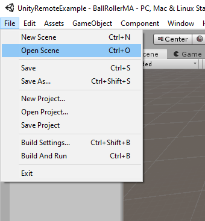
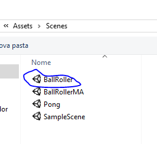
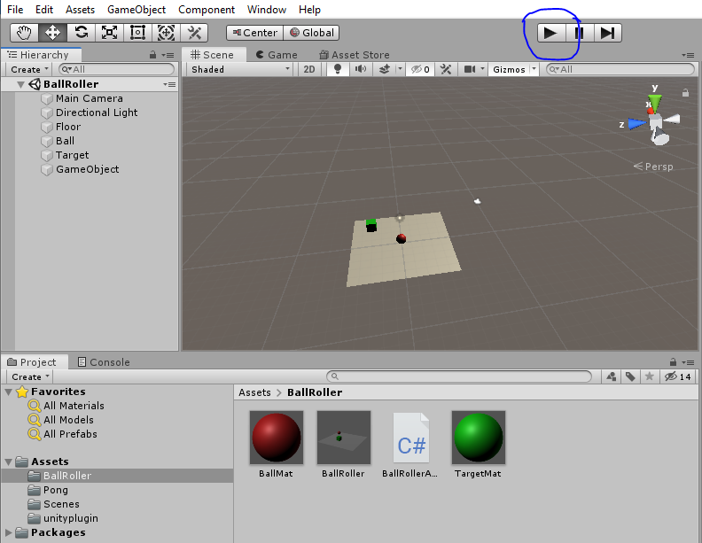
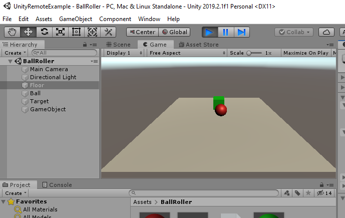
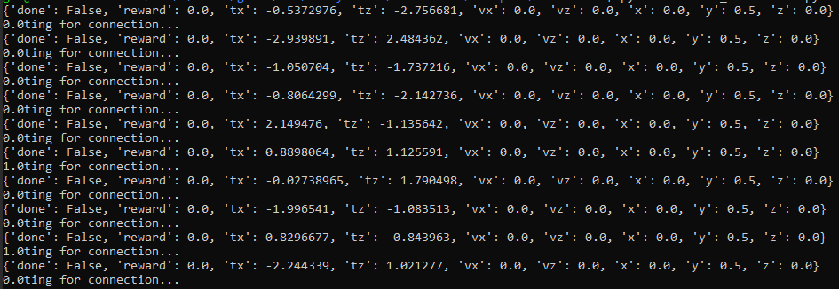

# What is UnityRemotePlugin?
UnityRemotePlugin is a way to connect your Unity application to Python code. Therefore, it's possible with UnityRemote connecting your games and virtual reality applications to vast libraries set written in Python. For example, there are many deep reinforcement learning algorithms written in Python. Here we provide some examples with the A3C (Asynchronous Advantage Actor-Critic) algorithm. Moreover, you can write your code in Python to control game aspects better controlled in Python.

# How to use the UnityRemotePlugin?
UnityRemotePlugin has two components. The first component is the *server-side* code written in C#. The second component is the *client-side* code written in Python.

We recommend that you have some version of Unity 2019 and start by looking at the examples available in the directories *examples*. Start by example *examples/CubeAgent* for the first look in UnityRemotePlugin. Also, see the documentation available in directory *doc*. See the complete documentation in Table 1.

Table 1: Documentation.

| Tutorial        |                                    Link                                          |
|-----------------|---------------------------------------------------------------------------------------|
| API Overview    |  [doc/overeview.md](doc/overview.md)                                           |
| UnityRemote with OpenAI Gym      | [doc/unityremotegym.md](doc/unityremotegym.md)                         |
| A3C Implementation     |  [doc/a3cintro.md](doc/a3cintro.md)                        |
| GMPROC (multiprocessing) | [GMPROC](clientside/unityremote/unityremote/gmproc/README.md)

## Installation

First, you need to install *clientside* component. Open the Ubuntu command-line console and enter in directory *clientside/unityremote*. Run the following command:

```
pip3 install -e .
```

Waiting for the installation ends, this may take a while. If you want to install gym and a3c algorithm support, go to directory *clientside/gym* and run the following command:

```
pip3 install -e .
```

Waiting for the installation ends.

Now, run Unity and open project available in *exemples/BallRoller*.  Then open the BallRoller scene (available on *Assets/scenes*) if it is not already loaded.






Then, press the play button and run the random_ballroller.py script located in *examples/BallRoller/Client*.



```
python3 random_ballroller.py
```



Output logs:


If no error message was displayed, then UnityRemotePlugin was installed correctly.

# Requirements

Tested Systems
----------

- Operation System: Ubuntu 18.04, and 19.10.
     * Python >= 3.7.5.
     * Unity >= 2019.3.0f6 (64 bits for GNU/Linux or Windows).

- Operation System: Ubuntu >= 20.04
    * Anaconda with Python3.7: UnityRemote A3C default implementation depends on a version of the *TensorFlow API* smaller than 2 (1.4 recommended). *TensorFlow 1.4* is not supported by *Python3.8*. However, running ***apt install python3*** installs Python 3.8 by default. Therefore, it is necessary to get Python3.7 or before on *Ubuntu 20.04*.  ***Anaconda Python3.7*** version is a principal solution for this problem. Ensure that the conda environment created is referring to Python version 3.7.
    * Unity >= 2019.3.0f6 (64 bits for GNU/Linux or Windows).

- Operation System: Windows 10 >= 19041.329
    * It's possible run UnityRemote on Windows 10, however, default machine learning features don't work, except if UnityRemote run on WSL1 or WSL2. Soon I will publish a tutorial explaining how this is possible.
    * Unity >= 2019.4

Unfortunately, UnityRemotePlugin does not have support for mobile applications.


# Development Stage: Alpha 4.

The Alpha development stage ranges from 0 to 10. In this stage, the API is still in the formulation stage, meaning that the API of the mode application undergoes future changes that make it incompatible with the current version.

In the Beta development stage, new features can be added, but without changing the programming interface. The interface is stable at this stage, but its implementation is not complete and is not considered stable. The Beta stage goes from level 1 to level 4. Levels 2 and 3 are considered pre-release.

The final version ends a development cycle and is given a version name. Version names start at 01 to infinity and are followed by an underline plus the year of release.

